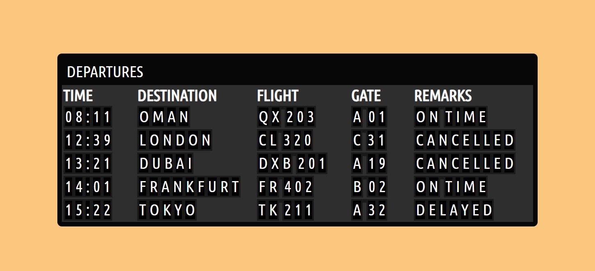

# JavaScript Flight Widget #

Created by following the [Build a ROTATING flight widget with JavaScript!](https://www.youtube.com/watch?v=xs5aOs-Wpxw&list=WL&index=2) tutorial by [@kubowania](https://github.com/kubowania).

## Project Description ##

Using JavaScript and CSS to create a basic 'flight widget' that displays departures loaded from an array. The project uses JavaScrip to parse and display the data, and CSS to style and annimate using keyframes. I would like to 'upgrade' the project by using the OpenSky Network API to display live arrivals and departures at a given airport.

